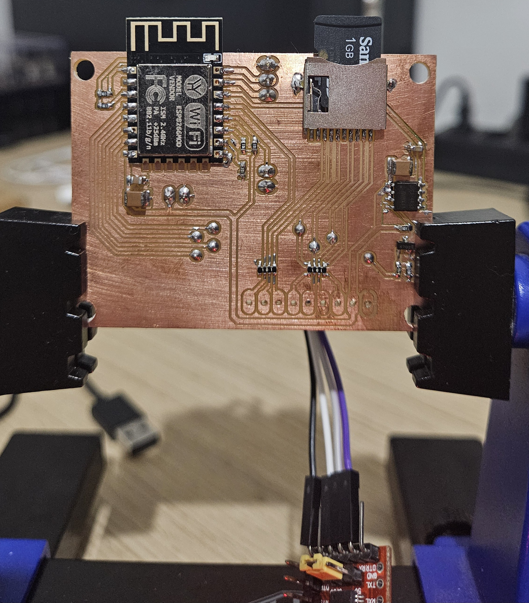
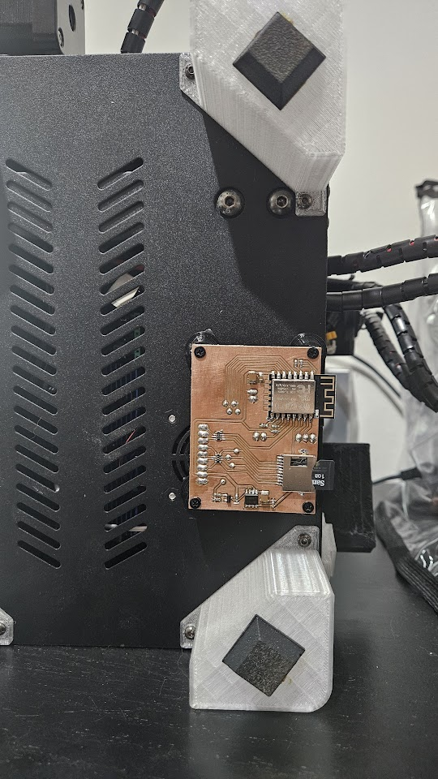
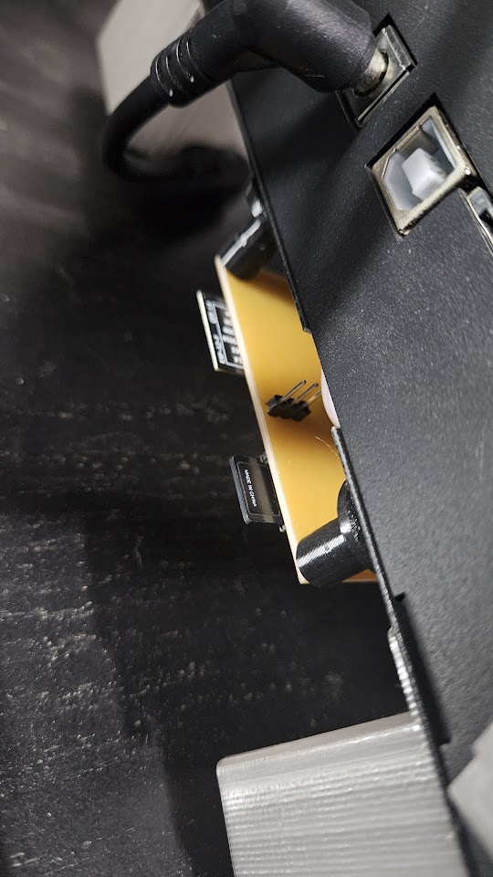

# ESP8266 SD Card File Server For 3D Printer

This project mimics the file upload endpoint of OctoPrint allowing to send gcode from prusa slicer and saving direct to SD card.

It is based on ardyesp/ESPWebDAV and FYSETC/ESPWebDAV.
 
SD card is shared between ESP8266 (SPI) and 3d printer (SDIO) running Marlin firmware with a custom change. 

The ESP8266 control the SD Card detection pin from the 3D Printer board. When it receive a file upload it simulate a SD card removal from the 3D Printer and then initialize the SD Card in SPI mode. When the file upload is done it performs a power cycle of the SD Card, otherwise the SD Card wont work in SDIO mode.

This change in Marlin allow the SDIO lines from the SD card to be shared with the ESP8266. When the card is removed from the 3D Printer Marlin detects and disable the SDIO hardware and set these pins to input.

### 3D Printer
The tests were made using a Kingroon KP3S. This printer have a MakerBase Robin Nano clone board with a connector for a external SD board.

### Firmware update
Firmware update can be done via browser throught url `<esp-ip>/update`

### Dependencies
- [ESP8266 Arduino](https://github.com/esp8266/Arduino)  version 3.1.2

  
  

